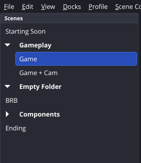
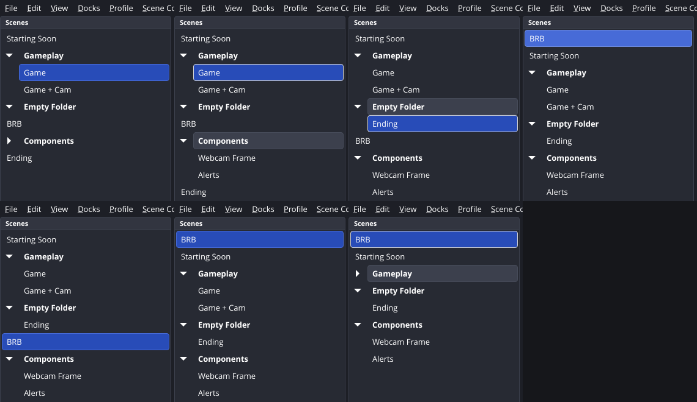
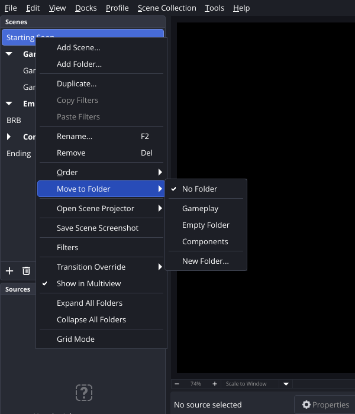
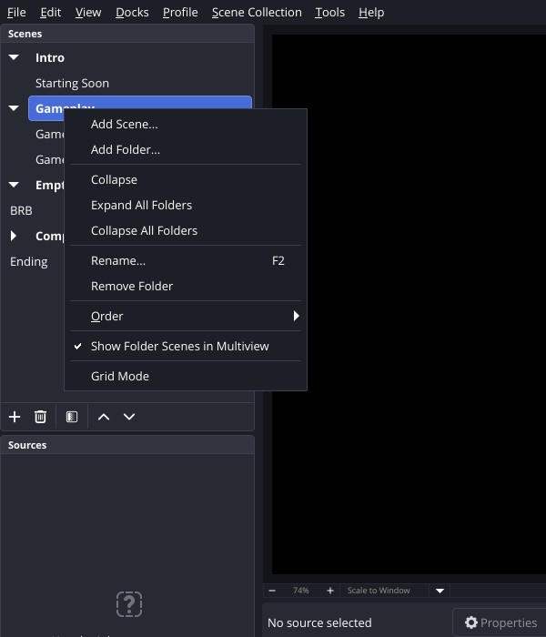

# Proposal: Scene Organization Tools (RFP #5076)

Collapsible folders for the Scenes dock, stored so that older versions of OBS can still load the
scene collection and keep its folders when they save it. The scene enumeration APIs stay unchanged,
and a small frontend API exposes the folders to plugins.

A working implementation against current `master` (e7f0b0d) exists as three commits, along with
screenshots taken under Xvfb on Linux (see "Status" at the end).

---

## 1. RFP requirements and how they are covered

| RFP requirement (incl. maintainer comments) | Covered by |
|---|---|
| Group related scenes in the Scenes list | Folders in the Scenes dock. A folder is a header row followed by its scenes (§2). |
| Conditionally hide/show groups or associated scenes | Collapse/expand per folder (indicator, double-click, Left/Right keys), "Expand All / Collapse All Folders", and a per-folder "Show Folder Scenes in Multiview" toggle (§2, §6). |
| Follow established usability conventions | Tree-style arrows (the same theme indicator the Sources dock uses for groups), indentation, inline rename with F2, drag and drop onto, between and out of folders, Left/Right keyboard navigation, undo/redo (§2). |
| Easy to add or remove, predictable behavior when removed | Collections without folders are not changed at all. Removing a folder never removes scenes: they stay at the same position as top-level scenes. Undo is available (§2, §7). |
| Behave reasonably with the multiview | Multiview keeps showing every scene (minus "Show in Multiview" opt-outs) in dock order, whether a folder is collapsed or not (§6). |
| File format as backward compatible as possible (downgrade safe), keep updating the old structure (jp9000) | `scene_order` is still written as the full flat list. Membership lives in per-scene private settings, which every OBS version preserves. Folder metadata goes in a new `scene_folders` key that older versions ignore (§3). |
| "Normal functions that return the scene list should be unaltered … all scenes in tree order, minus the groups" (jp9000) | `obs_frontend_get_scenes()` / `obs_frontend_get_scene_names()` return all scenes in dock order and never return folders (§5). |
| Prefer frontend-only changes, no libobs changes (jp9000, cg2121) | No libobs change. Folders exist only in the frontend (§4). |
| "Grouping as metadata stored for each scene … as simple and compact as possible" (jp9000) | Per-scene `scene_folder` private setting plus one small array (§3). |
| Collapsible folders that do nothing but sort the Scenes list (Fenrirthviti) | Folders are not sources, have no hotkeys, transitions or filters (§2, §6). |
| New API frontend-facing ("v2" functions) | Six `obs_frontend_*scene_folder*` functions and `OBS_FRONTEND_EVENT_SCENE_FOLDERS_CHANGED` (§5). |
| Windows, macOS, Linux | Pure Qt/C++ in the frontend, with no platform-specific code. Built and tested on Linux; Windows/macOS rely on CI (§8). |

## 2. User experience



- **Folders** are bold header rows with an expand/collapse indicator. Scenes inside a folder are
  indented in list mode. Folders cannot be nested, which follows jp9000's "simple and compact".
- **Create**: context menu → "Add Folder…" (on a scene, a folder or empty space). The folder is
  inserted after the selected top-level entry. On a scene: "Move to Folder" → "New Folder…"
  creates a folder and moves the scene into it in one step.
- **Rename**: F2, or context menu → "Rename…". This uses the same inline editor as scenes. Empty
  and duplicate folder names are rejected with the existing message boxes.
- **Remove**: Del key, the toolbar remove button, or context menu → "Remove Folder". Non-empty
  folders ask for confirmation ("The scenes inside it will not be removed."). The scenes stay at
  the same position as top-level scenes.
- **Collapse/expand**: click the indicator, double-click the folder, press Left/Right on a focused
  folder, or use "Expand All / Collapse All Folders". The state is saved with the collection.
- **Drag and drop**:
  - Dropping onto a folder header appends the scene to that folder (and expands it).
  - Dropping between the scenes of a folder places the scene there.
  - Dropping below the last scene of a folder keeps it in the folder. Dropping above the next
    top-level entry moves it out.
  - Dragging a folder moves it together with its scenes.
  - Grid mode supports the same operations based on tile position.
- **Move Up/Down/Top/Bottom** (toolbar and context menu): a scene inside a folder moves within that
  folder. Top-level scenes and folders move past whole folders.
- **Adding a scene** while a folder or a scene inside a folder is selected creates the new scene in
  that folder (next to the selection, the same as today's "insert after current").
- **Selecting a folder** does not change the current/preview scene. The existing actions (rename,
  remove, move) act on the folder.
- **A scene that becomes current inside a collapsed folder** (hotkey, studio mode transition,
  `obs_frontend_set_current_scene`, websocket) expands that folder. This follows Qt's tree view
  behavior, so the active scene is always visible in the dock.
- **Grid mode**: folders are tiles with the indicator. Collapsed folders hide their scene tiles.



| Scene context menu | Folder context menu |
|---|---|
|  |  |

## 3. Data model and file format

A scene collection gains one optional top-level key and one optional private setting per scene:

```jsonc
{
  "scene_order": [            // unchanged: every scene, flat, in dock order
    {"name": "Starting Soon"}, {"name": "Game"}, {"name": "Game + Cam"},
    {"name": "BRB"}, {"name": "Webcam Frame"}, {"name": "Alerts"}, {"name": "Ending"}
  ],
  "scene_folders": [          // new: ignored by older versions
    {"name": "Gameplay",     "collapsed": false, "position": 1},
    {"name": "Empty Folder", "collapsed": false, "position": 3},
    {"name": "Components",   "collapsed": true,  "position": 4}
  ],
  "sources": [
    {"name": "Game", "id": "scene", "private_settings": {"scene_folder": "Gameplay"}, ...},
    ...
  ]
}
```

- **Membership** is per-scene metadata (`private_settings.scene_folder`), as jp9000 suggested.
  Private settings are saved and loaded verbatim by every OBS version, so an older OBS that
  re-saves the collection keeps the membership. Membership also travels with the scene through
  undo of a scene removal.
- **`position`** is the number of scenes in `scene_order` that precede the folder header. Folders
  with scenes always sit right before their first scene, and empty folders keep their place.
- **Loading** (`BuildSceneTreeLayout`) combines the flat order, the membership and the folder
  list:
  - Folders referenced by a scene but missing from `scene_folders` (because the file was last
    saved by an older version) are recreated, expanded, at the position of their first scene.
  - Scenes are gathered into their folder even if an older version reordered them apart.
  - Every scene appears exactly once.
  - Duplicate or nameless folders and out-of-range positions are ignored or clamped.
- **Collections without folders are written exactly as before**: no `scene_folders` key, and no
  private setting is added.

### Compatibility matrix

| Scenario | Result |
|---|---|
| New OBS loads an old collection | Unchanged: no folders, same order. |
| Older OBS loads a collection with folders | Every scene loads, in the same order as the dock (folders flattened). |
| Older OBS re-saves it, then new OBS loads it | Folders come back from private settings at the same positions. Only collapsed state and empty folders are lost. |
| New OBS saves, then loads | Exact round trip (tested). |

### Alternatives considered

- *Separate file next to the collection* (first proposal in the thread): it is lost on export/import
  and can go out of sync, and jp9000 asked to keep everything in the collection JSON.
- *Folders as entries inside `scene_order`*: older versions would misplace scenes, because
  `LoadSceneListOrder()` uses the array index as the target row.
- *Membership only in `scene_folders`*: this also works for downgrades, but a re-save by an older
  version would drop all folders. Private settings keep them.

## 4. Frontend implementation (Qt)

The current `SceneTree` is a `QListWidget` (with a grid mode based on `QListView::IconMode`), and
`ui->scenes` appears more than 60 times in the frontend, mostly walking its rows (`count()`,
`item(i)`, `currentItem()`, …). Rewriting it as a `QTreeView` would lose grid mode and touch all of
them. The implementation therefore keeps the `QListWidget` and adds folder rows:

- **Rows**: a folder is a `QListWidgetItem` with `SceneTree::FolderRole`. Its name is kept in
  `FolderNameRole` so a rename can be validated against the old name, and its state in
  `FolderCollapsedRole`. A scene row flagged with `InFolderRole` belongs to the closest folder row
  above it. `UpdateFolders()` normalizes the flags (a scene that follows a top-level scene cannot be
  in a folder), hides the scenes of collapsed folders (`setHidden`), and sets accessibility
  descriptions.
- **Model**: `frontend/models/SceneTreeLayout.{hpp,cpp}` (no Qt) holds the layout (top-level scenes
  and folders with their scenes), the build/flatten functions used for loading and saving, and JSON
  serialization for undo/redo. `SceneTree::GetLayout()` / `ApplyLayout()` convert between rows and
  the model.
- **Painting**: `SceneRenameDelegate` (already set on the dock) draws the indicator through
  `QStyle::PE_IndicatorCheckBox` on a hidden `QCheckBox` with the `indicator-expand` class, so all
  themes get the same arrow as Sources dock groups. It indents scenes inside folders and moves the
  inline editor next to the indicator.
- **Drag and drop**: `SceneTree::dropEvent` works out the target folder and row from
  `dropIndicatorPosition()`. Only folder rows have `Qt::ItemIsDropEnabled`, so "on item" means "into
  this folder". It moves the whole entry and then lets Qt finish the event with the existing
  "already moved" pattern used by `SourceTree`. Grid mode keeps its position-based logic and only
  counts visible tiles.
- **OBSBasic**: the folder logic lives in a new `widgets/OBSBasic_SceneFolders.cpp`. It covers
  load/save, context menus, rename/remove, undo actions, the private-settings sync and the
  frontend API helpers. Small changes elsewhere:
  - `SaveSceneListOrder`, `LogScenes`, `obs_frontend_get_scenes` and `RenameListValues` skip
    folder rows.
  - The "last scene" check counts only scenes.
  - Folder selection does not switch scenes.
  - Removing the current scene selects the nearest *scene*, never a folder.
  - The transform dialog ignores folder rows.

## 5. API additions (`obs-frontend-api.h`)

```c
EXPORT char **obs_frontend_get_scene_folder_names(void);                 /* dock order, bfree() */
EXPORT char *obs_frontend_get_scene_folder(obs_source_t *scene);          /* NULL if top level, bfree() */
EXPORT void obs_frontend_get_scene_folder_scenes(const char *folder,
                                                 struct obs_frontend_source_list *sources);
EXPORT bool obs_frontend_add_scene_folder(const char *name);
EXPORT bool obs_frontend_remove_scene_folder(const char *name);           /* keeps the scenes */
EXPORT bool obs_frontend_set_scene_folder(obs_source_t *scene, const char *folder); /* NULL = top level, creates folder */

OBS_FRONTEND_EVENT_SCENE_FOLDERS_CHANGED                                   /* appended to the enum */
```

- The existing functions are unchanged. `obs_frontend_get_scenes()` and
  `obs_frontend_get_scene_names()` still return every scene in dock order and never a folder.
- New callbacks are appended to `obs_frontend_callbacks`. The new event is appended to the end of
  `enum obs_frontend_event`, so plugin ABI is preserved.
- Calls from other threads are marshalled to the UI thread with `WaitConnection()`, like the
  existing scene collection functions.
- Documented in `docs/sphinx/reference-frontend-api.rst`.
- obs-websocket needs no change. Exposing folders there (e.g. `GetSceneFolderList`) can be a
  follow-up in that repository.

## 6. Interaction with existing features

- **Multiview**: it uses `obs_frontend_get_scenes()`, so it shows all scenes in dock order,
  collapsed or not. The per-scene "Show in Multiview" still works, and the folder menu can toggle it
  for all scenes of a folder at once.
- **Studio mode**: double-clicking a folder toggles it and never triggers a transition.
  Transitioning to a scene in a collapsed folder reveals it. Program/preview handling is unchanged.
- **Scene-switch hotkeys and per-scene transition overrides**: unchanged, because they are attached
  to scenes. Folders have none.
- **Duplicate scene**: the copy is inserted next to the original, so it is in the same folder.
- **Scene collection import/export, duplicate collection**: the folders are part of the JSON.
- **Plugins that walk the dock's `QListWidget` directly**: they will see folder rows, which have no
  `OBSRef`. The documented frontend API is unaffected.

## 7. Undo/redo

All folder edits are undoable with a "layout snapshot" action (serialized `SceneTreeLayout`
before/after): add, rename, remove, move to/out of a folder, and drag-and-drop reordering of
scenes/folders. Scene drag reordering was not undoable before and now is. Undo keeps the current
expand/collapse state of folders. Undoing "Delete scene" now restores the scene's exact position,
including its folder (the old index-based restore could land in the wrong place once folders
exist). Expanding/collapsing is view state and is not added to the undo stack.

## 8. Accessibility, localization, platforms

- **Accessibility**:
  - Folder rows expose "Folder, expanded/collapsed, N scene(s)" through `Qt::AccessibleDescriptionRole`.
  - Scenes inside a folder expose "In folder 'X'".
  - Everything works from the keyboard: arrows, Left/Right to collapse/expand or jump to the
    parent folder, F2, Del, and the menu key.
- **Locale**: 21 new `en-US.ini` strings (`Basic.Main.SceneFolder.*`, `Undo.Scenes.Reorder`,
  `Undo.SceneFolder.*`). Other languages come through Crowdin as usual.
- **Platforms**: no platform code. On Windows and macOS the differences are styling (QStyle with
  theme stylesheets) and the macOS rename shortcut (Return), which reuse the existing scene code
  paths.

## 9. Test plan

1. **Unit test** (`test/cmocka/test_scene_tree_layout.cpp`, 8 cases): flat order and positions,
   save → load round trip, collection without folders, an older version loading every scene, an
   older version re-saving (folders rebuilt from private settings), scenes reordered by an older
   version, invalid folder data, and undo serialization.
2. **End-to-end** with the real `obs` binary under Xvfb, using scripted scene collections and
   `xdotool`:
   - load and save round trip;
   - expand, drag into a folder, reorder, undo, redo, collapse;
   - a collection saved by an older version (no `scene_folders`);
   - a legacy collection without folders (written back unchanged);
   - context menu flows (new folder, rename, remove with confirmation, delete scene in folder and
     undo);
   - grid mode drag;
   - multiview window.
3. **Frontend API**: a small test plugin calls all six functions, counts the new event and switches
   to a scene in a collapsed folder.
4. **For review on Windows/macOS**: CI builds, a manual pass over the same flows with the Yami and
   System themes, and a check with a screen reader (NVDA/VoiceOver) that the folder descriptions are
   announced.

## 10. Milestones

| Milestone | Content | Estimate |
|---|---|---|
| M1 | Data model + unit tests (commit 1) | done |
| M2 | Scenes dock folders: UI, persistence, undo, locale (commit 2) | done |
| M3 | Frontend API + docs (commit 3) | done |
| M4 | Maintainer feedback on UX/file format, Windows/macOS CI, theme polish | 1–2 weeks after acceptance |
| M5 | Review iterations until merge | as needed |

Follow-ups outside this RFP that the design leaves room for: a scene search/filter field, folder
colors, and an obs-websocket request for folders.

## 11. Questions for maintainers

1. Is auto-expanding a collapsed folder when one of its scenes becomes current the preferred
   behavior? The alternative is to keep it collapsed and highlight the folder row.
2. Should "Add Folder" also get a toolbar button? It would need a new icon in each theme.
3. Is `test/cmocka` the right place for the frontend model test? It is not wired into the top-level
   CMake today.

## Status

Implemented and validated on Linux (Ubuntu 24.04, Qt 6.11.1, FFmpeg 8.0) against `master@e7f0b0d`,
in three commits:

- `frontend: Add scene tree layout model`
- `frontend: Add folders to the Scenes dock`
- `obs-frontend-api: Add scene folder functions`
